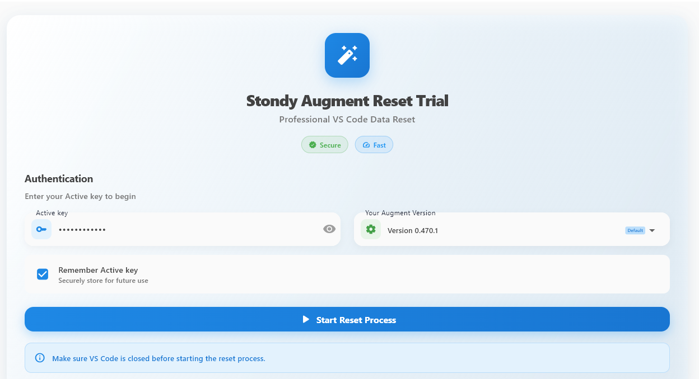
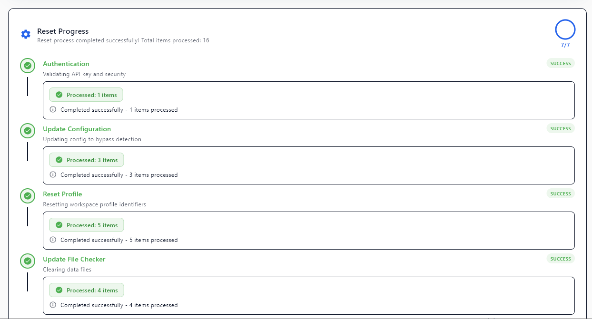
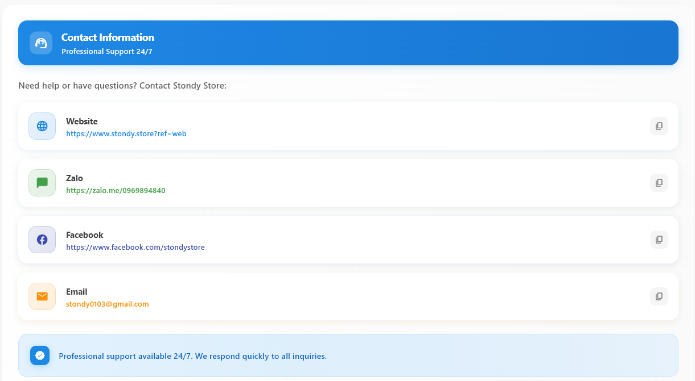

# 🔧 Stondy Augment Reset Tool (Only Support Vscode)

*Công cụ reset hệ thống Augment Code*
(Still working for 0.496.1)

---

## 📸 Screenshots

### 🖥️ Main Application

### ⏳ Processing Status

### 📞 Contact Information

## 🌍 Multi-Language Support

<b>🇻🇳 Tiếng Việt</b>

### 🚀 Cách sử dụng

| Bước | Thao tác | Mô tả |
|:----:|----------|-------|
| 1️⃣ | **Mở ứng dụng** | Chờ khởi tạo và kiểm tra bảo mật |
| 2️⃣ | **Nhập Active Key** | Điền key hợp lệ từ hệ thống |
| 3️⃣ | **Chọn phiên bản** | Tùy chọn phiên bản Augment |
| 4️⃣ | **Start Reset** | Bắt đầu quá trình reset |
| 5️⃣ | **Hoàn thành** | Thành công hoặc thực hiện lại |

### ⚠️ Lưu ý quan trọng
- 🔒 **Đóng VSCode** trước khi reset
- 🌐 **Kết nối internet** ổn định
- ⏳ **Không tắt ứng dụng** khi đang chạy

<b>🇺🇸 English</b>

### 🚀 How to Use

| Step | Action | Description |
|:----:|--------|-------------|
| 1️⃣ | **Open App** | Wait for initialization & security check |
| 2️⃣ | **Enter Active Key** | Input valid key from system |
| 3️⃣ | **Select Version** | Choose Augment version (optional) |
| 4️⃣ | **Start Reset** | Begin reset process |
| 5️⃣ | **Complete** | Success or retry |

### ⚠️ Important Notes
- 🔒 **Close VSCode** before reset
- 🌐 **Stable internet** connection required
- ⏳ **Don't close app** during process

<b>🇨🇳 中文</b>

### 🚀 使用方法

| 步骤 | 操作 | 描述 |
|:----:|------|------|
| 1️⃣ | **打开应用** | 等待初始化和安全检查 |
| 2️⃣ | **输入激活密钥** | 输入系统提供的有效密钥 |
| 3️⃣ | **选择版本** | 选择Augment版本（可选） |
| 4️⃣ | **开始重置** | 开始重置过程 |
| 5️⃣ | **完成** | 成功或重试 |

### ⚠️ 重要提示
- 🔒 **关闭VSCode** 在重置之前
- 🌐 **稳定的网络** 连接必需
- ⏳ **不要关闭应用** 在处理过程中

---

## 🛠️ Features

- 🔄 **Multi-Version Support** - Compatible with various Augment versions
- 💻 **Windows Optimized** - Full support for Windows 10/11

---

## 👨‍💻 Author

**Stondy**

---

**Contact Me to take tool**

*Made with ❤️ by Stondy*

